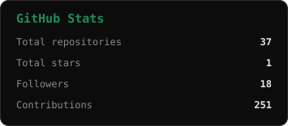
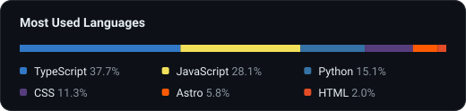
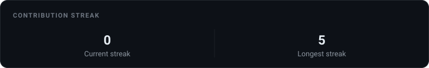

<h1 align="center">Luciano K. Dal Pai</h1>

  

  
  

  

## Languages

  
  
  
  
  
  
  
  

## Frameworks & tools

  
  
  
  
  
  
  
  
  
  
  
  

## GitHub stats

  
  

  

## Quote of the day

  

  
    Self-hosted, refreshed automatically via <a href="./.github/workflows">GitHub Actions</a>
    &nbsp;·&nbsp;
    
  

